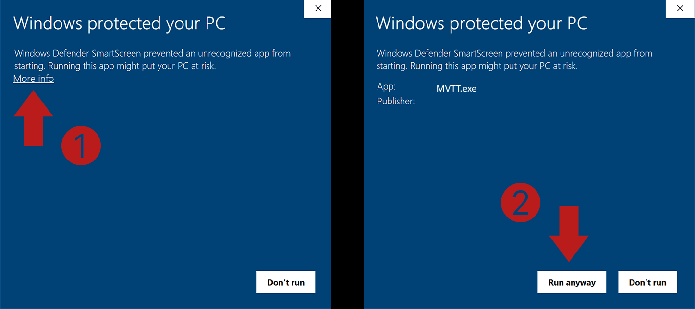

# Release Builds
This folder contains precompiled release builds for windows.

**MVTT.exe** implements the default behaviour

**MVTT_m0.exe** allways selects Monitor 0

**MVTT_m1.exe** allways selects Monitor 1

**MVTT_m2.exe** allways selects Monitor 2 

# "Windows Protected Your PC" Warning
When first starting the prebuild version, you may get a message stating: "Windows Defender SmartScreen prevented an unrecognizable app from starting. Running this app might put your PC at risk."

Starting MVTT.exe will not put your computer at risk. Unfortunately preventing this message would cost a lot of money, which I am not willing to pay. You can safely ignore this message and continue with it:

