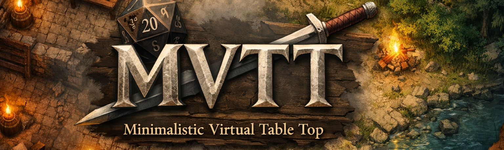
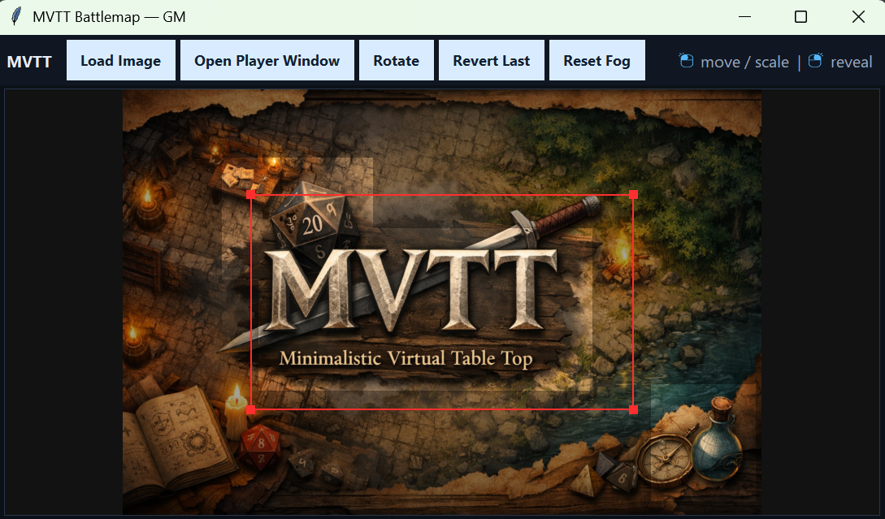
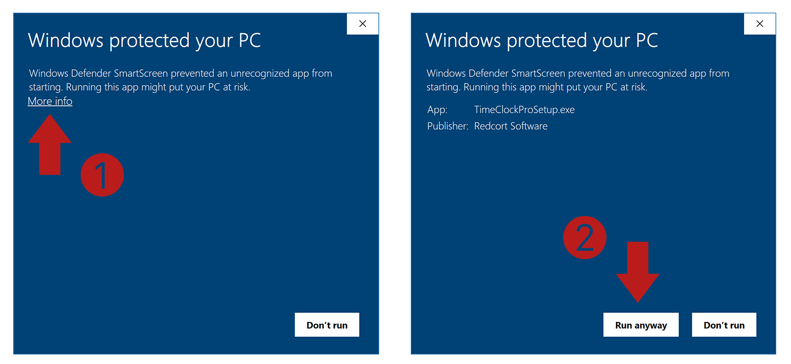

### This tool is meant to be used with a table TV for tabletop games such as D&D, Pathfinder, and DSA. It displays a fullscreen image on the table TV, which is controlled from a smaller preview window. By default the image is covered by a fog of war that can be revealed from the preview screen. Two versions are available.

# MVTT Browser App
This version is aimed at users who don't have permission to run unsigned executables on their system or who prefer not to. It runs in any modern browser, even without an internet connection.

To start, just double-click `MVTT-browser-app/index.html` and follow the instructions in your browser.

To open the second view, click "Open Player Window" and move that window to the connected table TV.

**Download** the folder [MVTT-browser-app](MVTT-browser-app).

# MVTT Executable App
This version is more streamlined and can detect the table TV automatically, but it may require you to allow running unsigned executables (see "Executable App first Execution" below).

**Download** the Windows executable [MVTT-executable-app/dist/MVTT_Battlemap.exe](MVTT-executable-app/dist/MVTT_Battlemap.exe).

# User Guide

This is the control screen with the following control elements:

- **Load Image**: Opens a file chooser to select an image.
- **Open Player Window**: Opens the player window for the table TV.
- **Rotate**: Rotates the view by 90°.
- **Revert Last Change**: Reverts the last change (can be used multiple times).
- **Reset Fog**: Resets the fog of war, covering the entire image again.
- **Red-Rectangle**: Selects what is shown on the table TV.
    - **Left-click, hold and drag a corner**: Rescales the table TV view.
    - **Left-click, hold and drag the center**: Moves the table TV view.
    - **Right-click, hold and draw a rectangle**: Removes fog of war.

# Executable App first Execution ("Windows Protected Your PC" Warning)
When first starting the prebuilt version, you may get a message stating: "Windows Defender SmartScreen prevented an unrecognizable app from starting. Running this app might put your PC at risk."

Running `MVTT_Battlemap.exe` should not harm your computer. Preventing this SmartScreen warning requires code-signing the executable, which can be costly. You can ignore the SmartScreen warning and run the application; if you prefer not to, use the MVTT Browser App instead.

## Disclaimer
This code was created with GitHub Copilot.

This codebase is released under the MIT License.

Use at your own risk. The software is provided "as is", without warranty of any kind.
