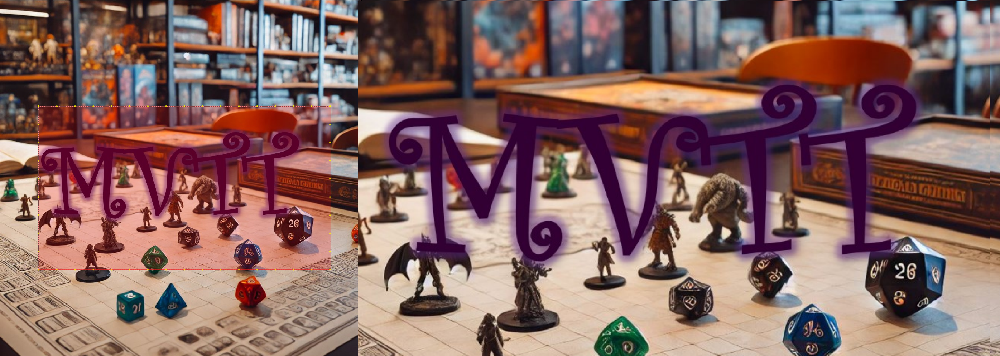

# MVTT-Minimalistic-Virtual-Table-Top
This tool is meant to be used in conjunction with a table TV for tabletop games like D&amp;D, Pathfinder and DSA. It shows a fullscreen image on the table TV, that is easily controlled by a mini version on the preview screen. A masking feature also allows for hidden areas on the map.

<a href="/Builds/20250221/" download>Download latest build for WIndows here</a>


## User Guide

### <ins>Moving and Scaling View</ins>
**Shift** + **Mouser Left Click** + Drag: Move View Rectangle (red)

**Shift** + **Mouse Scroll**: Scale the View Rectangle (red)

**Shift** + **Page-Up** / **Page-Down**: Scale the View Rectangle (red)

**Hint** The yellow dots surrounding the red view rectangle represent a grid of 1 inch or 2,54mm to aid correct scaling without the need of watching the table TV. This feature doesn't work for every setup, as some drivers don't support reading out the actual monitor size.
<table><tr><td>  </td><td align="center">&#8594;<br>Shift + Scroll<br>&#8594;</td><td>  </td></tr></table>

### <ins>Masking aka. Fog of War</ins>
**Mouser Left Click** + **Drag**: Create a new masking rectangle (green)
<table><tr><td>  </td><td align="center">&#8594;<br>Left Click + Drag<br>&#8594;</td><td>  </td></tr></table>

### <ins>Mask Inversion</ins>
**Shortcut I**: Invert the masking
<table><tr><td>  </td><td align="center">&#8594;<br>[I]<br>&#8594;</td><td>  </td></tr></table>

### <ins>Mask Reset</ins>
**Shortcut R**: Remove all masking rectangles (green)
<table><tr><td>  </td><td align="center">&#8594;<br>[R]<br>&#8594;</td><td>  </td></tr></table>


## How to Start the Executable
### <ins>The easy way</ins>
Just drag the image you want to display onto the MVTT.exe. It will automatically start with that image on the default display.

### <ins>With Parameters</ins>
You can launch the tool from the command line or from a batchfile with parameters. You can find example batch files in the **Builds** folder:
- **First Parameter:** The path to the image file you want to display.
- **Second Parameter (Optional):** The index of the monitor on which to display the second window. If not provided, the tool will use the second monitor if available, or the primary monitor if only one exists.

**Example:**
```bash
MVTT.exe "C:\path\to\your_image.png" 1
```


## How to setup the development environment

The code is written in python and it is recommended to create a virtual environment for the project as follows:

a) Create and activate a Virtual Environment
 1. Open a terminal (or command prompt) in your project directory
 2. Create a new virtual environment: `python -m venv env`
3. Activate the virtual environment: `env\Scripts\activate`. After activation, your prompt should change (e.g., you'll see `(env)` at the beginning).

b) Install the Requirement Packages
With the virtual environment activated, install all necessary packages from the `requirements.txt` file:
`pip install -r requirements.txt`

c) Run the project as usual, for example:
`python MVTT.py path/to/your_image.png 1`

## Disclaimer
All code provided in this project was generated by an AI language model (ChatGPT, version GPT-4) and is provided "as is" without any warranty. Use it at your own risk.
